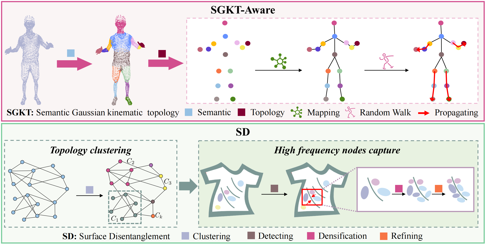

<div align="center">

<h1>Gaussian Control with Hierarchical Semantic Graphs in 3D Human Recovery</h1>

HUGS is excellent at handling **semantic obfuscations caused  by occlusion** and **high-frequency surface details**.

<div style="width: 70%; text-align: center; margin:auto;">
    
    <em>HUGS combines human semantics and kinematic topological associations for 3D human reconstruction.</em>
</div>

[//]: # (:open_book: For more visual results, go checkout our <a href="" target="_blank">project page</a>)

This repository will contain the official implementation of **Gaussian Control with Hierarchical Semantic Graphs in 3D Human Recovery**.

<div align="left">

## Updates
[3/2024] Training and inference codes for ZJU-Mocap_refine and MonoCap are released.

## Requirements
<!-- --- -->
NVIDIA GPUs are required for this project.
We recommend using anaconda to manage the python environments.

```bash
    conda create --name hugs python=3.8
    conda activate hugs
    conda install pytorch==2.0.0 torchvision==0.15.0 torchaudio==2.0.0 pytorch-cuda=11.8 -c pytorch -c nvidia
    
    pip install ninja
    pip install submodules/diff-gaussian-rasterization
    pip install submodules/diff-gaussian-rasterization-obj
    pip install submodules/simple-knn
    pip install --upgrade https://github.com/unlimblue/KNN_CUDA/releases/download/0.2/KNN_CUDA-0.2-py3-none-any.whl
    pip install -r requirement.txt
    pip install paddlepaddle -i https://mirror.baidu.com/pypi/simple
    pip install paddlehub -i https://mirror.baidu.com/pypi/simple
    pip install matplotlib
    pip install Pillow
    pip install git+https://github.com/NVlabs/tiny-cuda-nn/#subdirectory=bindings/torch
    pip install git+https://github.com/openai/CLIP.git
    pip install pyg_lib torch_scatter torch_sparse torch_cluster torch_spline_conv -f https://data.pyg.org/whl/torch-2.0.0+cu118.html

    # if there are any issues with protobuf, change the version of protobuf as below:
    # pip install protobuf==3.20.0 
```

Tips: We implement the [alpha mask loss version](https://github.com/ashawkey/diff-gaussian-rasterization) based on the official [diff-gaussian-rasterization](https://github.com/graphdeco-inria/diff-gaussian-rasterization/tree/59f5f77e3ddbac3ed9db93ec2cfe99ed6c5d121d).

## Set up Dataset
<!-- --- -->

Please follow instructions of [Instant-NVR](https://github.com/zju3dv/instant-nvr/blob/master/docs/install.md#set-up-datasets) to download ZJU-Mocap-Refine and MonoCap dataset.


## Download SMPL Models

Register and download SMPL models [here](https://smpl.is.tue.mpg.de/). Put the downloaded models in the folder smpl_models. Only the neutral one is needed. The folder structure should look like

```
./
├── ...
└── assets/
    ├── SMPL_NEUTRAL.pkl
```

## Generate SMPL model with semantic labels

Register and download SMPL models [here](https://smpl.is.tue.mpg.de/). Put the downloaded models in the folder smpl_models. Only the neutral one is needed. The folder structure should look like

```bash
python process_smpl.py
```


## Download CLIP weights

Register and download CLIP weights [here](https://openaipublic.azureedge.net/clip/models/5806e77cd80f8b59890b7e101eabd078d9fb84e6937f9e85e4ecb61988df416f/ViT-B-16.pt). Put the downloaded models in the folder clip_models. The folder structure should look like

```
./
├── ...
└── assets/
    ├── ViT-B-16.pt
```

## Download DPT Models
- [DPT](https://github.com/isl-org/DPT). We use an off-the-shelf single-view depth estimator DPT to predict the depth for the reference image.
  ```bash
  cd ./submodules
  git clone https://github.com/isl-org/DPT.git
  mkdir dpt_weights
  ```
  Download the pretrained model [dpt_hybrid](https://github.com/intel-isl/DPT/releases/download/1_0/dpt_hybrid-midas-501f0c75.pt), and put it in `dpt_weights`.


## Training
<!-- --- -->

### Training command on ZJU_MoCap_refine dataset
```bash
bash train_zju_mocap_refine.sh
```

### Training command on MonoCap dataset
```bash
bash run_monocap.sh
```

## Evaluation
<!-- --- -->

### Evaluation command on ZJU_MoCap_refine dataset
```bash
bash eval_zju_mocap_refine.sh
```

### Evaluation command on MonoCap dataset
```bash
bash eval_monocap.sh
```

### Evaluate with Canny Algorithm and High Pass Filter based on Fourier transform
```bash
python image_process.py
```
Change the path in image_process.py to the path of the image.